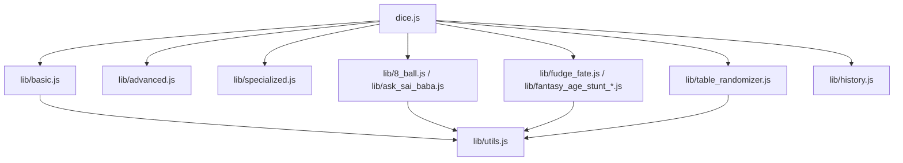

# Code Documentation - Dice Roller Plugin

This document outlines the technical implementation and codebase architecture of the Dice Roller plugin.

## Technical Architecture

The plugin is structured as modular ES modules under the `lib/` directory, which are bundled into a single scope-safe IIFE distribution using `esbuild`.

---

## File Modules & Responsibilities

### 1. Entry Point (`dice.js`)
Exposes the plugin manifest containing `appOption` (Basic, Advanced, Specialized, etc.) and `noteOption` (Table - Randomizer). It binds the options directly to their respective async handlers.

### 2. Basic Roller (`lib/basic.js`)
- Handles prompting the user with clean, descriptive inputs for dice counts, faces, min/max limits, unique results, and keep/drop counts.
- Leverages local storage settings (`Previous_Roll`) to remember inputs, clearly notifying the user when previous settings are loaded.
- Implements Fisher-Yates shuffle for unique randomizations and handles exploding dice rules.

### 3. Advanced Parser (`lib/advanced.js`)
- Contains a mathematical recursive descent parser that evaluates dice notations combined with basic arithmetic (e.g. `3d6 + 1d4 * (2^1d10)`).
- Validates formulas and computes the final roll sum using clean custom roll input prompts.

### 4. Specialized Dice (`lib/specialized.js`)
- Simulates Sicherman non-standard dice distributions.
- Calculates intransitive dice rolling cycles and poker dice hands with a user-friendly parameter selection form.

### 5. Oracles (`lib/8_ball.js` & `lib/ask_sai_baba.js`)
- Offers a classic Magic 8-Ball yes/no guidance tool with direct prompt questions.
- Includes a Shirdi Sai Baba spiritual oracle querying a single intuitive number within a 1-720 range.

### 6. Fudge/Fate & AGE Stunt (`lib/fudge_fate.js` & `lib/fantasy_age_stunt_*.js`)
- Implements RPG-specific stunt tables and Fate dice outcomes with clear parameter selectors.

### 7. Table Randomizer (`lib/table_randomizer.js`)
- Extracts markdown tables from the active note and performs column-by-column random combinations based on configurable row count inputs.

### 8. History & Utilities (`lib/history.js` & `lib/utils.js`)
- Houses `viewRollHistory` (checking for empty content first) and `clearAuditHistory` (prompting the user with a specific confirmation keyword before deletion).
- `lib/utils.js` houses `getNoteUUID`, which resolves temporary `local-` UUIDs to synced online UUIDs (documented in `/common-issues-and-fixes/local-uuid-handling.md`).

---

## Bundling & Dev Tools
- **Bundler**: Bundled into `build/dice.compiled.js` via `esbuild`.
- **Testing**: Scaffolds Jest test coverage inside `test/dice.test.js` using node's experimental VM modules for native ESM support.
